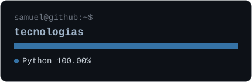

### `~$ contributions --last-year`

 

<table style="border-collapse: collapse; width: 860px;">
  <tr>
    <td style="padding: 0; border: none; width: 430px;"></td>
    <td style="padding: 0; border: none; width: 430px;"></td>
  </tr>
</table>

 

### `~$ skills --list`

 

 

### `~$ stats --github`

<table style="border-collapse: collapse; width: 860px;">
  <tr>
    <td style="padding: 0; border: none; width: 430px;"></td>
    <td style="padding: 0; border: none; width: 430px;"></td>
  </tr>
</table>

